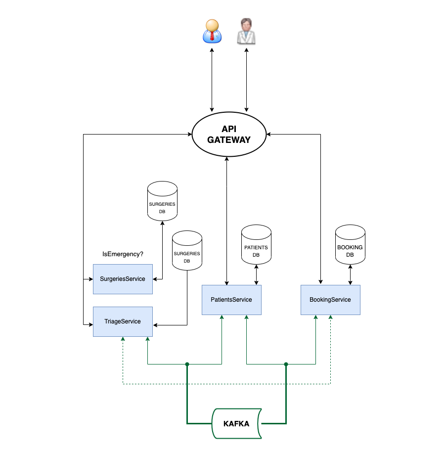
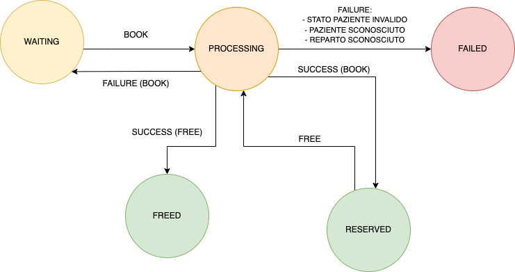
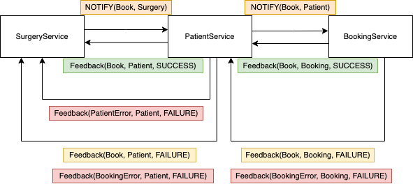
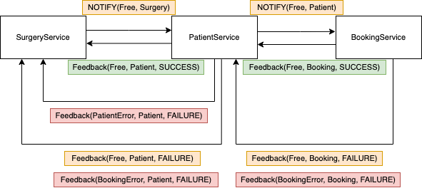

# Microservices SAGA Hospital Manager
### Mockup di un gestore ospedaliero costruito su microservizi, per il corso di DSBD, a.a. 2021/22

---

## Abstract


L'idea dietro questo progetto riguarda la divisione dei concern e del carico computazionale per un'infrastruttura informativa di un sistema sanitario (singola clinica, insieme di cliniche convenzionate, etc.).

Il caso d'uso considerato è quello della registrazione dello stato di un intervento in clinica, dovendo fare fronte al censimento del paziente e alla disponibilità in struttura prima di poter confermare un'azione.

Si facciano due esempi pratici:


- un operatore dell'accettazione inserisce in lista un paziente per un intervento, il quale potrà essere programmato (**Surgery**) o d'urgenza / pronto soccorso (**Triage**); rispettando le regole sopra-citate, prima di confermare l'inizio dell'intervento bisognerà verificare i vincoli sul censimento paziente e sulla disponibilità del reparto.


- un operatore del reparto segnala la fine di un intervento in corso, al fine di aggiornare lo stato su database del paziente e la disponibilità del reparto.


Si è prevista quindi una suddivisione in tre tipologie di servizi distinti:

- **SurgeriesService** e **TriageService**, due repliche dello stesso microservizio formale, con la differenza principale nella meccanica di gestione delle code di pazienti in attesa: su base FIFO per le Surgery, su base priority per i Triage.

- **PatientService**, un microservizio che censisce i pazienti per nome e email, e ne mantiente lo stato (se è in corso un intervento o meno).

- **BookingService**, un microservizio che mantiene il censimento dei reparti per nome, ciascuno con una sua capienza massima, e una occupazione attuale aggiornata nel tempo.

I suddetti servizi sono stati implementati in **Spring Boot**: 
- **Spring Web** per definire i REST controller dei servizi
- **Spring Cloud** e gli **Stream** per definire publisher e subscriber asincroni, con binding su **Apache Kafka**.

Ciascuno dei tre microservizi possiede un proprio database **MySQL**, e comunica con gli altri servizi tramite message broker **Kafka** con topic dedicati.

Sono previsti anche un gateway globale e un servizio di registration.

---

## Macchina a stati



Un intervento, una volta creato, è posto in stato di **WAITING** in attesa di essere pescato, sulla base della logica di scheduling del suo servizio.

A quel punto, passa in stato di **PROCESSING** per tentare un **BOOK** (si chiede di riservare un posto nel reparto), e se si ha successo l'intervento passa in stato **RESERVED**.

A sua volta, si può richiedere (da API) di liberare il posto in reparto: con un evento di **FREE** lo stato passa prima in **PROCESSING**, e successivamente in **FREED**, dal quale non verrà più utilizzato.

In qualunque momento, da **PROCESSING** lo stato può passare in **FAILED** per tre casi valutati:
- è stata richiesta un'operazione non valida sul paziente (FREE mentre è già FREE, BOOK mentre è in SURGERY o TRIAGE).
- è stato richiesto un Paziente con un id non presente su database.
- è stato richiesto un Reparto con un id non presente su database

I passaggi in questa macchina a stati sono gestiti tramite due saghe.

---

## Saghe

Si è scelto un approccio di **Saga Choreography**, in cui non si prevede un unico Orchestrator a gestire l'avanzamento della Saga, bensì l'avanzamento dipende dallo scambio diretto di eventi tra i microservizi con meccanismo.

### Saga di booking in reparto


In questa Saga, la "happy path" prevede:

1) l'invio di un **NOTIFY** event di **BOOK** da parte del SurgeryService
2) la verifica da parte del PatientService e l'inoltro al BookingService
3) un path inverso di messaggi di **FEEDBACK** con stato di **SUCCESS** rispetto all'operazione di BOOK.

Tuttavia, si possono prevedere:
- la comunicazione di un **FAILURE** di BOOK (es. niente posti liberi), riportando la macchina in stato di WAITING.
- la comunicazione di un **FAILURE** per **BOOKING ERROR**, consegnato dal BookingService, al PatientService, al SurgeryService, portando la macchina in stato di **FAILED**.
- la comunicazione di un **FAILURE** per **PATIENT ERROR**: in questo caso non si arriva a contattare il BookingService, e con un solo Feedback da PatientService a SurgeryService la macchina è posta in stato di **FAILED**.

### Saga di liberazione posto in reparto


Questa saga rappresenta il percorso equivalente per richiedere la liberazione del posto in reparto con azione **FREE**.

Si noti solo come il caso di **Feedback** con **FAILURE** su **FREE** non dovrebbe accadere, poiché è sempre previsto che si possa liberare un posto occupato.

---

## Struttura dei Microservizi

I tre microservizi osservano un'organizzazione comune delle classi Spring.
Prendiamo ad esempio il microservizio **Patient**:

```
|- config
|---- StreamConfig.java
|
|- controller
|--- MainController.java
|
|- entities
|---- Patient.java
|---- PatientRepository.java
|
|- events
|---- Event.java
|---- FeedbackSurgeryEvent.java
|---- NotifySurgeryEvent.java
|
|- service
|---- MainService.java
|
|- stream
|---- SagaStream.java
|
|- PatientApplication.java
```

Volendo soffermarsi sulle seguenti tipologie di classi:

- **controller**:

    Ogni controller definisce un path base del servizio (i.e. `/patient`) su cui costruisce i seguenti mapping:
    - `POST /create` per creare sulla repository una entity del tipo gestito dal servizio
    - `GET /findAll` per ottenere la collezione completa delle entity gestite dal servizio
    - (Nel caso delle surgeries, `DELETE /free` per richiedere la terminazione di un intervento)
    

- **entities**:

    Ogni servizio gestisce una entity rispettivamente, e su di essa costruisce una repository per la permanenza del dato su database MySQL.

- **events**: 

    Sfruttano un'interfaccia comune `Event` per definire classi d'appoggio per i messaggi scambiati nelle Saghe tra i servizi.

    In particolare:

    - `NotifySurgeryEvent`: rappresenta la progressione di una richiesta di inizio o terminazione di un intervento, dal SurgeryService, al PatientService, fino al BookingService.
    - `FeedbackSurgeryEvent`: rappresenta il cammino opposto, che può rappresentare una catena di feedback all'indietro, oppure (in qualunque punto della catena) può indicare un failure e la richiesta di compiere azioni compensative.

- **service**:

    Il "centro stella" del container, si occupa di gestire l'ingresso e l'uscita di eventi presso il servizio.

    Nel caso dei SurgeryService, implementa anche la logica di business di controllo schedulato delle surgeries in coda.

    Ai fini di creare un mockup, queste classi inizializzano anche una collezione di entity di partenza nelle rispettive repository.

- **stream**:

    Oggetto che definisce - in collaborazione con il file `application.yml` - il mapping dei canali di input e output degli eventi coi rispettivi topic in Kafka.

---

## Come eseguire

- #### Docker
    Questa repo sfrutta `docker-compose` per distribuire assieme i microservizi:

    ```
    docker-compose build
    docker-compose up
    ```

- ### Kubernetes

    Gli oggetti Kubernetes sono raggruppati nella cartella `k8s`, con tutti gli oggetti necessari per un singolo microservizio in un solo file rispettivamente.

    Ad esempio:
    ```
    kubectl apply -f k8s/surgery.yaml
    ```